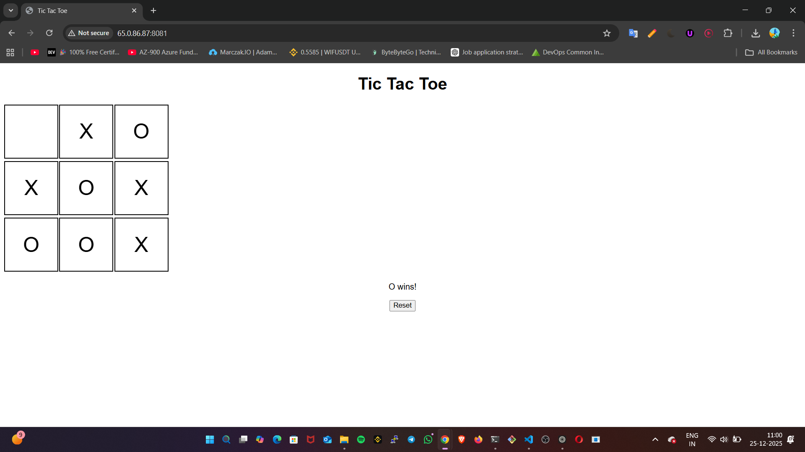

---

# 🎮 Tic Tac Toe – Java Web App on AWS EC2 with Jenkins & Docker CI/CD

A simple **web-based Tic Tac Toe game** built using **Java 21 and Spring Boot**, containerized with **Docker**, and deployed automatically using **Jenkins CI/CD** on an **Ubuntu AWS EC2 instance**, triggered by **GitHub webhooks**.

This project demonstrates a **complete real-world DevOps workflow** running fully on EC2.

---

## 📸 Final Output

The application runs successfully on an **AWS EC2 Ubuntu server** and is accessible via the public IP.

<p align="center">
  
</p>

Example:

```
http://<EC2_PUBLIC_IP>:8081
```

---

## 🚀 Features

* Web-based Tic Tac Toe game
* Java 21 + Spring Boot backend
* HTML, CSS, JavaScript frontend
* Jenkins CI/CD running on EC2
* Dockerized application on EC2
* GitHub webhook automation
* Automatic redeployment on every git push

---

## 🏗️ Tech Stack

| Layer      | Technology               |
| ---------- | ------------------------ |
| Cloud      | AWS EC2                  |
| OS         | Ubuntu (EC2)             |
| Language   | Java 21                  |
| Framework  | Spring Boot              |
| Build Tool | Maven                    |
| CI/CD      | Jenkins                  |
| Container  | Docker                   |
| Base Image | Eclipse Temurin 21 (JRE) |
| SCM        | GitHub                   |

---

## 📂 Project Structure

```
tic-tac-toe-java-web-app/
├── Dockerfile
├── Jenkinsfile
├── pom.xml
├── README.md
└── src
    └── main
        ├── java
        │   └── com/example/tictactoe
        │       ├── TicTacToeApplication.java
        │       └── GameController.java
        └── resources
            └── static
                ├── index.html
                ├── script.js
                └── style.css
```

---

## ✅ Prerequisites (EC2 – DO NOT SKIP)

### 1️⃣ AWS EC2 Instance

* Instance Type: `t2.micro` or higher
* OS: **Ubuntu 20.04 / 22.04 / 24.04**
* Security Group:

  * TCP **8080** → Jenkins
  * TCP **8081** → Application
  * TCP **22** → SSH

---

### 2️⃣ Java 21 (JDK)

```bash
sudo apt update
sudo apt install -y openjdk-21-jdk
```

Verify:

```bash
java -version
javac -version
```

---

### 3️⃣ Maven

```bash
sudo apt install -y maven
```

Verify:

```bash
mvn -v
```

---

### 4️⃣ Docker

```bash
sudo apt install -y docker.io
sudo systemctl start docker
sudo systemctl enable docker
sudo usermod -aG docker ubuntu
newgrp docker
```

Verify:

```bash
docker --version
```

---

### 5️⃣ Jenkins on EC2

```bash
sudo apt install -y jenkins
sudo systemctl start jenkins
sudo systemctl enable jenkins
```

Access Jenkins:

```
http://<EC2_PUBLIC_IP>:8080
```

Unlock Jenkins:

```bash
sudo cat /var/lib/jenkins/secrets/initialAdminPassword
```

---

## 📦 Using the GitHub Repository

### 1️⃣ Clone on EC2

```bash
git clone https://github.com/arunprakash432/tic-tac-toe-java-web-app.git
cd tic-tac-toe-java-web-app
```

---

### 2️⃣ Make Changes (Local or EC2)

Edit:

* Frontend (`index.html`, `script.js`)
* Backend Java files
* `Dockerfile` / `Jenkinsfile`

---

### 3️⃣ Commit & Push

```bash
git add .
git commit -m "your commit message"
git push origin main
```

---

## 🔗 Jenkins + GitHub Integration

### Jenkins Pipeline Job

1. Jenkins → **New Item**
2. Select **Pipeline**
3. Pipeline definition → **Pipeline script from SCM**
4. SCM → Git
5. Repo URL:

   ```
   https://github.com/arunprakash432/tic-tac-toe-java-web-app.git
   ```
6. Branch: `main`
7. Save

---

### GitHub Webhook

1. GitHub → Repository → **Settings**
2. **Webhooks** → Add webhook
3. Payload URL:

   ```
   http://<EC2_PUBLIC_IP>:8080/github-webhook/
   ```
4. Content type: `application/json`
5. Trigger: **Push event**
6. Save

---

## 🔄 CI/CD Workflow on EC2

1. Push code to GitHub
2. GitHub webhook triggers Jenkins on EC2
3. Jenkins:

   * Verifies Java 21
   * Builds app using Maven
   * Builds Docker image
   * Runs Docker container
4. App redeployed automatically on EC2

---

## ⚙️ Jenkinsfile

```groovy
pipeline {
    agent any

    environment {
        JAVA_HOME = '/usr/lib/jvm/java-21-openjdk-amd64'
        PATH = "${JAVA_HOME}/bin:${env.PATH}"
    }

    stages {
        stage('Verify Java') {
            steps {
                sh 'java -version'
                sh 'javac -version'
                sh 'mvn -v'
            }
        }

        stage('Build') {
            steps {
                sh 'mvn clean package'
            }
        }

        stage('Docker Build') {
            steps {
                sh 'docker build -t tic-tac-toe .'
            }
        }

        stage('Docker Run') {
            steps {
                sh '''
                docker rm -f tic-tac-toe || true
                docker run -d -p 8081:8080 --name tic-tac-toe tic-tac-toe
                '''
            }
        }
    }
}
```

---

## 🐳 Dockerfile

```dockerfile
FROM eclipse-temurin:21-jre-jammy

WORKDIR /app

COPY target/tic-tac-toe-0.0.1.jar app.jar

EXPOSE 8080

ENTRYPOINT ["java", "-jar", "app.jar"]
```

---

## ▶️ Run Manually on EC2 (Without Jenkins)

```bash
mvn clean package
docker build -t tic-tac-toe .
docker run -p 8081:8080 tic-tac-toe
```

Access:

```
http://<EC2_PUBLIC_IP>:8081
```

---

## 🧪 Common Issues & Fixes

| Issue                    | Fix                            |
| ------------------------ | ------------------------------ |
| Java 21 not used         | Set `JAVA_HOME`                |
| `javac not found`        | Install `openjdk-21-jdk`       |
| Docker permission denied | Add user to docker group       |
| Jenkins not triggering   | Check webhook & security group |

---
---

## 👨‍💻 Author

**Arun Prakash**
GitHub: [https://github.com/arunprakash432](https://github.com/arunprakash432)

---

## ⭐ Final Note

This project runs **entirely on an Ubuntu AWS EC2 instance** and demonstrates:

✔ Cloud setup
✔ CI/CD automation
✔ Containerized Java application
✔ Real-world DevOps practices

🎉 **Excellent work completing this end-to-end project!**

